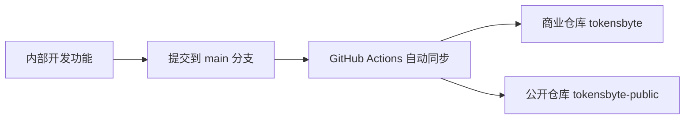
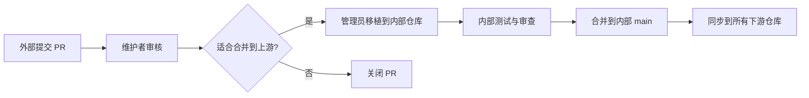

# TokensByte 仓库管理统一指南

## 📋 概述

本指南定义了三层仓库架构的管理规范、同步机制和安全最佳实践，实现从内部核心到商业合作伙伴再到公开社区的安全、自动化、可追溯的代码分发与回流体系。

```
                    内部仓库 (tokensbyte-WS) - 私有
                   /                          \
   [过滤敏感内容] /                            \ [过滤商业功能]
                 /                              \
    商业仓库 (tokensbyte) - 私有        公开仓库 (tokensbyte-public) - 公开
```

### 核心策略
- ✅ 内部仓库 `tokensbyte-WS` 作为单一真相来源（Source of Truth）
- ✅ 自动过滤同步到下游 `tokensbyte` (商业) 和 `tokensbyte-public` (公开)
- ✅ 外部贡献经过审核后 cherry-pick 回上游

---

## 🏗️ 仓库层级说明

| 层级 | 仓库 | 可见性 | 目标用户 | 限制内容 |
|------|------|--------|----------|----------|
| 🔒 内部 | tokensbyte-WS | 私有 | 公司内部开发人员 | 无限制，包含所有代码和工具 |
| 🔐 商业 | tokensbyte | 私有 | 合作伙伴 | 内部开发工具、敏感配置等 |
| 🌐 公开 | tokensbyte-public | 公开 | 所有人 | 内部工具 + 支付、营销、财务等商业功能 |

---

## 🔑 权限配置

### 内部仓库 (tokensbyte-WS)
| 团队 | 角色 | 权限说明 |
|------|------|----------|
| Core Team | Maintain | 核心开发人员，可直接推送至 `main`（建议使用 PR） |
| Admin | Owner | 仓库管理员，可管理设置和 Secrets |

### 商业仓库 (tokensbyte)
| 团队 | 角色 | 权限说明 |
|------|------|----------|
| Partners | Triage | 合作伙伴，可提交 Issue 和 PR |
| Maintainers | Maintain | 维护人员，可合并 PR |
| Admin | Owner | 仓库管理员 |
| **限制** | - | 禁止直接推送至 `main`，所有变更必须通过 PR |

### 公开仓库 (tokensbyte-public)
| 团队 | 角色 | 权限说明 |
|------|------|----------|
| Maintainers | Maintain | 核心维护者，可合并 PR |
| Admin | Owner | 仓库管理员 |
| **限制** | - | 禁止直接推送至 `main`，所有变更必须通过 PR |

---

## 🛡️ 分支保护规则

在 GitHub 中配置：`Settings` → `Branches` → `Branch protection rule`

### 内部仓库 (tokensbyte-WS) - main 分支
| 设置项 | 配置 |
|--------|------|
| Require PR before merging | ⚪ 可选（建议开启） |
| Require approvals | ⚪ 可选 |
| Require status checks | ❌ 关闭 |
| Allow force pushes | ❌ 禁止 |
| Allow deletions | ❌ 禁止 |

### 商业仓库 (tokensbyte) - main 分支
| 设置项 | 配置 |
|--------|------|
| Require PR before merging | ✅ 开启 |
| Require approvals | ✅ 至少1人 |
| Require status checks | ✅ 开启 |
| Do not allow bypassing | ✅ 开启 |
| Allow force pushes | ❌ 禁止 |
| Allow deletions | ❌ 禁止 |

### 公开仓库 (tokensbyte-public) - main 分支
| 设置项 | 配置 |
|--------|------|
| Require PR before merging | ✅ 开启 |
| Require approvals | ✅ 至少1-2人 |
| Require status checks | ✅ 开启 |
| Do not allow bypassing | ✅ 开启 |
| Restrict push permissions | ✅ 开启 |
| Allow force pushes | ❌ 禁止 |
| Allow deletions | ❌ 禁止 |

---

## 🔄 同步机制

本同步机制采用 **“覆盖复制（Copy-Sync）”** 方案：
1. 克隆目标下游仓库（`commercial` 或 `public`）。
2. 清空下游仓库工作区（保留 `.git` 文件夹）。
3. 按照白名单规则（`include`）将内部仓库中的选定文件和目录复制过去。
4. 按照黑名单规则（`exclude`）删除复制过去的敏感业务和接口目录。
5. 执行 `git add -A` 并提交为一个汇总的同步 commit，提交信息会自动引用内部仓库最新的 Commit SHA 和 Commit 消息。
6. 使用普通的 `git push` 推送到下游仓库（**不进行强制推送**），从而完美兼容并支持 GitHub 的分支保护规则（Branch Protection Rules）。

### 工具依赖
本方案基于标准的 Git 命令行以及内置脚本，**无任何第三方依赖**（无需安装 `git-filter-repo`）。

### 配置文件
- `.sync/config/repos.json`：定义三个仓库的 Git URL 和分支。
- `.sync/config/filters.json`：定义各层级需要显式包含（`include`）和过滤（`exclude`）的文件和目录。

### 同步规则
当前配置的同步策略为：仅保留 `README.md`、`backend`、`frontend`、`docker-compose.yml` 及 `.github/workflows/build-ghcr.yml`，且同步到公开仓库时会剔除所有支付、钱包、分销与财务等敏感代码文件。

### 使用方法

#### Windows (PowerShell)
```powershell
# 同步全部
.sync/scripts/sync.ps1 all

# 只同步内部→商业
.sync/scripts/sync.ps1 internal-to-commercial

# 只同步内部→公开
.sync/scripts/sync.ps1 internal-to-public
```

#### Linux/Mac
```bash
# 同步全部
.sync/scripts/sync.sh all

# 只同步内部→商业
.sync/scripts/sync.sh internal-to-commercial

# 只同步内部→公开
.sync/scripts/sync.sh internal-to-public
```

---

## 🤖 自动化同步 (GitHub Actions)

### 工作流配置
内部仓库已配置 `.github/workflows/sync-downstream.yml`：

| 触发方式 | 说明 | 同步目标 |
|---------|------|---------|
| **自动触发** | 向 `main` 分支推送代码时 | 同步到商业仓库和公开仓库 |
| **手动触发** | GitHub Actions 界面运行 | 可选择 `all` / `internal-to-commercial` / `internal-to-public` |

> ⚠️ 注意：`.sync/`、`.github/`、`README.md`、`UPDATE.md` 文件的变更不会触发自动同步。

### Token 配置
1. 创建 PAT 令牌：https://github.com/settings/tokens/new?scopes=repo,workflow&description=tokensbyte-sync-token
2. 在内部仓库 Secrets 中添加 `SYNC_TOKEN`（具有所有仓库读写权限）

---

## 🚦 工作流

### 正向同步（内部 → 外部）


### 反向合并（外部 → 内部）


#### 外部 PR 处理步骤
1. 在商业/公开仓库审核 PR
2. 确认代码质量和安全性
3. 在内部仓库创建对应 feature 分支
4. 移植代码并进行测试
5. 合并到内部 `main` 分支
6. 运行同步脚本更新所有下游仓库
7. 合并外部 PR

---

## 🔐 安全最佳实践

### 公开仓库安全配置
1. **安全功能开启**
   - ✅ Dependabot alerts
   - ✅ Dependabot security updates
   - ✅ Secret scanning
   - ✅ Push protection

2. **权限管理**
   - 只给最核心的 2-3 人 Write 权限
   - 其他贡献者通过 Fork + PR 方式贡献
   - 定期审查权限列表

3. **禁止行为**
   - ❌ 直接推送到 `main` 分支
   - ❌ 提交敏感信息（API Key、密码等）
   - ❌ 提交商业功能代码
   - ❌ 在公开仓库处理安全修复（先在内部修复再同步）

---

## 🚨 应急处理

### 敏感信息泄露
1. 立即撤销泄露的凭证
2. 在内部仓库删除敏感信息
3. 运行同步脚本更新所有仓库
4. 必要时重写 Git 历史

### 紧急安全修复
1. 在内部仓库修复
2. 充分测试验证
3. 立即运行同步脚本更新所有仓库
4. 在公开仓库发布安全公告

---

## 📞 常见问题

### Q: 如何添加新的过滤规则？
A: 编辑 `.sync/config/filters.json`，在对应层级的 `exclude` 数组中添加路径。

### Q: 同步会保留 Git 历史吗？
A: 不会保留详细的历史 commits。由于每次同步采用“覆盖复制”的汇总提交机制，下游仓库的历史只会包含每次同步时生成的汇总 commit（例如：`sync: update from internal at <SHA> (<Commit Message>)`）。这保证了下游仓库的历史是一条干净直观的线性记录，且无需强制推送（`-f`），从而能完美兼容分支保护。

### Q: 如何处理紧急的安全修复？
A: 在内部仓库修复后，立即运行同步脚本或触发 GitHub Actions 更新所有仓库。

### Q: 外部 PR 如何合并到上游？
A: 外部 PR 审核通过后，由管理员手动将代码移植到内部仓库，经过测试后合并，再同步到下游。

---

## 📋 GitHub 仓库检查清单

### 公开仓库 (tokensbyte-public)
- [ ] 配置 `main` 分支保护规则
- [ ] 设置合适的协作者权限
- [ ] 启用 Dependabot
- [ ] 启用 Secret Scanning
- [ ] 配置 Issue 和 PR 模板
- [ ] 添加 CONTRIBUTING.md
- [ ] 添加 README.md
- [ ] 添加 LICENSE
- [ ] 配置 GitHub Actions（如需要）

---

<div align="center">
<small>TokensByte 仓库管理最佳实践 · 2026</small>
</div>
