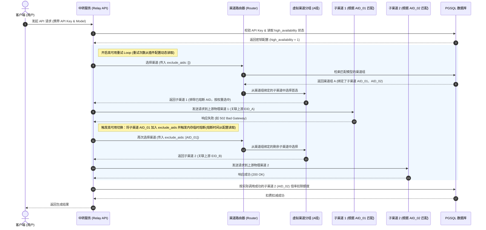

# 高可用上游渠道系统插件开发说明文档

本设计文档旨在为 TokensByte 系统开发一个**高可用上游渠道系统插件**（`high_availability_channel`）。该插件开启后，能够极大地提升系统 API 转发的稳定性和高可用性。

---

## 1. 业务逻辑与系统设计

### 1.1 核心需求与架构

高可用上游渠道系统插件开启后，提供以下三大核心功能：

1. **管理后台：多渠道分组绑定 (渠道虚拟化组)**：
   - 允许管理员在管理后台添加一个“渠道分组”。
   - 在选择渠道的上游供应源时，右侧菜单会多出一个 **“选择多渠道”** 的功能。
   - 通过该功能，管理员可以在右侧弹窗中复选多个已经配置的物理上游渠道。绑定时，系统将使用物理渠道的 **AID（渠道唯一辨识码，即 `group_aid`）** 进行绑定。
   - 被复选绑定的子渠道 AID 列表将直接保存在该渠道组的 `config` 字段中。
   - 当模型路由匹配到此“渠道分组”时，系统会在其绑定的所有活跃子渠道（根据 AID 匹配）中做智能轮询和 Failover 切换。
   - 在涉及到物理渠道所关联的 **“上游供应源辨识”** 时，系统统一使用上游的 **EID（上游唯一辨识码）** 进行记录和路由匹配。

2. **用户端：多渠道高可用切换（故障转移 Failover）**：
   - 用户端在创建或修改密钥时，可以开启 **“高可用密钥”** 功能（默认开启）。
   - **重试逻辑机制**：页面上没有单独的“路由重试开关”，它是由后端逻辑自动控制的。当检测到“高可用插件启用”且当前“密钥的高可用功能开启”时，后端底层的路由重试深度（`max_channel_retries`）自动开启；否则默认为 **1 次**（即失败即止，直接报错给用户）。
   - **参数与多选联动**：最大重试次数可通过管理后台的插件配置页面进行动态调整（如修改为 3 次或 5 次）。该限制与后台“多渠道绑定”的**勾选数量上限直接强制联动**，实现绝佳的前端体验。
   
3. **基于渠道倍率的精细计费**：
   - **计费激活机制**：虽然管理员默认可以在后台渠道列表中为各渠道设置 `rate`（渠道倍率），但在此插件启用前，计费计算会忽略该倍率（隐性以 1.0 计算）。
   - 插件启用后，系统将**正式激活**渠道倍率参与计算，在扣费时将其与模型的原始计费规则（`BillingRule`）进行乘积扣费。
   - 计费公式：
     $$\text{实际扣费} = \text{模型原始规则计费} \times \text{实际路由到的子渠道倍率 (Channel.rate)} \times \text{用户/站点折扣 (Discount)}$$
   - 提示用户：由于不同备用上游的渠道倍率不同，在使用高可用切换时，单次请求的计费可能会随切换的渠道产生上下浮动。

---

### 1.2 渠道路由与重试时序图

下图展示了当高可用密钥开启后，请求经过中转系统的多渠道智能分发与自动降级过程：



---

## 2. 数据库变更说明 (PgSQL)

本插件采用在现有的 `channels` 表中进行“虚拟化组扩展”的形式实现，同时在 `plugin_configs` 插入核心配置项供后台管理修改。

```sql
-- 1. 在密钥表 api_tokens 中添加高可用密钥功能字段
ALTER TABLE api_tokens ADD COLUMN IF NOT EXISTS high_availability INTEGER NOT NULL DEFAULT 1;
COMMENT ON COLUMN api_tokens.high_availability IS '是否开启高可用密钥功能 (0=禁用, 1=启用)';

-- 2. 往系统插件表中插入高可用上游插件记录
INSERT INTO plugins (name, title, description, is_enabled, allowed_levels, created_at, updated_at)
VALUES (
    'high_availability_channel', 
    '高可用上游渠道系统插件', 
    '启用后，支持管理后台配置高可用渠道组（一个虚拟渠道组绑定多个物理渠道 AID），支持多上游自动防灾切换与按子渠道倍率计费模式。', 
    1, -- 默认开启该插件
    'all',
    CURRENT_TIMESTAMP,
    CURRENT_TIMESTAMP
)
ON CONFLICT (name) DO NOTHING;

-- 3. 初始化动态配置参数至插件配置表 plugin_configs
INSERT INTO plugin_configs (plugin_name, config_key, config_value, created_at, updated_at)
VALUES 
    ('high_availability_channel', 'ha_max_retries', '3', CURRENT_TIMESTAMP, CURRENT_TIMESTAMP),
    ('high_availability_channel', 'ha_cooldown_429', '60', CURRENT_TIMESTAMP, CURRENT_TIMESTAMP),
    ('high_availability_channel', 'ha_cooldown_network', '300', CURRENT_TIMESTAMP, CURRENT_TIMESTAMP),
    ('high_availability_channel', 'ha_cooldown_auth', '1800', CURRENT_TIMESTAMP, CURRENT_TIMESTAMP)
ON CONFLICT (plugin_name, config_key) DO NOTHING;
```

---

## 3. 后端开发方案 (Rust)

后端改动主要涉及模型层、虚拟渠道路由匹配、计费公式层 and 控制层。为了系统环境的一致性，在内存熔断和路由中一律使用 **AID** 作为渠道的唯一标识，使用 **EID** 作为上游供应源的标识。

### 3.1 渠道组的路由匹配与负载均衡

在 [router.rs](file:///Volumes/D/webwwwai/tokensbyte-ws/backend/src/relay/router.rs) 中的 `select_channel` 里，如果路由匹配到的渠道是一个 **“高可用虚拟渠道组”**（其绑定的 `config` 字段里存有 `sub_channel_aids: Vec<String>`），则执行子级路由逻辑：

```rust
// backend/src/relay/router.rs

// 假设我们选中的渠道是一个组：
if channel.provider_type == "high_availability_group" {
    // 从 config 中解析子渠道的 AID 列表
    let sub_channel_aids: Vec<String> = serde_json::from_str::<serde_json::Value>(&channel.config)
        .ok()
        .and_then(|v| v.get("sub_channels").cloned())
        .and_then(|v| serde_json::from_value::<Vec<String>>(v).ok())
        .unwrap_or_default();
        
    // 通过 AID (group_aid) 批量拉取物理子渠道
    let mut sub_channels: Vec<Channel> = sqlx::query_as(
        "SELECT * FROM channels WHERE group_aid = ANY(?) AND status = 1"
    )
    .bind(&sub_channel_aids)
    .fetch_all(&state.db.pool)
    .await?;

    // 过滤掉当前被熔断排除的子渠道（结合 exclude_aids 与内存熔断器）：
    let now = std::time::Instant::now();
    sub_channels = sub_channels.into_iter().filter(|sub_c| {
        let aid = sub_c.group_aid.as_deref().unwrap_or("");
        if aid.is_empty() {
            return false; // 无效 AID 直接过滤
        }
        if exclude_aids.contains(&aid.to_string()) {
            return false; // 当前调用环路已被排除的
        }
        if let Some(blocked_until) = state.failed_channels.get(aid) {
            if blocked_until.value() > &now {
                return false; // 处于内存熔断中的
            }
        }
        true
    }).collect();

    if sub_channels.is_empty() {
        return Err(AppError::NotFound("该渠道分组下无可用的物理上游渠道".to_string()));
    }

    // 根据优先级和权重，从子渠道列表中进行随机加权选择：
    let highest_priority = sub_channels[0].priority;
    let top_tier_subs: Vec<Channel> = sub_channels.into_iter()
        .take_while(|c| c.priority == highest_priority)
        .collect();

    // 随机加权算法选择具体物理子渠道
    let selected_sub = weighted_select(&top_tier_subs)?;
    channel = selected_sub; // 替换为最终真实的物理上游渠道！
}
```

---

### 3.2 计费机制修改（引入并激活渠道倍率）

目前，系统在配置渠道时虽然可以填写 `rate`（渠道倍率），但是在计费引擎 `compute_cost` 中该字段并未参与扣费计算（目前默认为 1.0 折算）。本插件开启后，计费模块会**激活**该字段。

在所有请求处理 Handler（如 [chat.rs](file:///Volumes/D/webwwwai/tokensbyte-ws/backend/src/relay/chat.rs) 等）中，将计算费率时的折扣乘积结合实际调用渠道的 `rate` 进行相乘。

#### 示例改动：[chat.rs](file:///Volumes/D/webwwwai/tokensbyte-ws/backend/src/relay/chat.rs) 扣费部分
```rust
// 查找原有的折扣解析逻辑：
let umd = db_model.as_ref().and_then(|m| proxy::parse_user_model_discount(&ctx.model_discounts, &m.mid));
let (final_discount, discount_source) = proxy::resolve_discount(db_model.as_ref(), ctx.discount, umd);

// 校验“高可用上游渠道系统”插件是否全局启用：
let is_ha_plugin_enabled = crate::api::plugins::is_plugin_enabled(&state, "high_availability_channel").await;

// 如果插件启用，正式激活并应用渠道的倍率 (channel.rate) 乘数：
let applied_discount = if is_ha_plugin_enabled {
    final_discount * channel.rate
} else {
    final_discount
};

// 传入 applied_discount 进行费用计算：
let (quota_used, mut detail) = super::compute_cost(db_model.as_ref(), db_rule.as_ref(), &usage_tokens, applied_discount, &features);

if is_ha_plugin_enabled && channel.rate != 1.0 {
    detail.push_str(&format!(" | 渠道倍率: {}x", channel.rate));
}
```

---

### 3.3 重试与防灾路由控制 (带动态配置解析)

为了避免频繁执行数据库查询，系统会在 `AppState` 中维护一份内存配置项，并在管理员后台修改配置后重载更新。后端在路由时自动读取这些冷却时间和重试限制。

#### 示例改动：[chat.rs](file:///Volumes/D/webwwwai/tokensbyte-ws/backend/src/relay/chat.rs) 路由环路
```rust
let mut failed_channel_aids: Vec<String> = Vec::new();
let mut channel_retry_count = 0;

// 1. 从 AppState 的缓存中拉取最大重试次数限制 (ha_max_retries)，默认为 3
let ha_config_retries = state.ha_config_cache.max_retries.load(Ordering::Relaxed);

let is_ha_plugin_enabled = crate::api::plugins::is_plugin_enabled(&state, "high_availability_channel").await;
let max_channel_retries = if is_ha_plugin_enabled && token.high_availability == 1 {
    ha_config_retries // 动态重试次数开关
} else {
    1 // 高可用重试关闭
};

loop {
    // 选择渠道 (排除已失败的物理子渠道 AID)
    let channel = match proxy::select_channel_for_model_with_exclude(
        &state, &token, model, &ctx.user_group, &ctx.level_id, raw_path, &failed_channel_aids
    ).await {
        Ok(c) => c,
        Err(e) => {
            last_err = e;
            break; // 没有更多渠道可用
        }
    };
    
    // ... 执行请求并发送给渠道 ...
    
    let resp = match stream_builder.json(&stream_body).send().await {
        Ok(r) => r,
        Err(e) => {
            let aid = channel.group_aid.clone().unwrap_or_default();
            failed_channel_aids.push(aid.clone());
            channel_retry_count += 1;
            
            // 2. 根据捕获到的错误类型，读取插件配置中的熔断时间并写入内存
            let status_code = e.status().map(|s| s.as_u16()).unwrap_or(500);
            let cooldown_secs = match status_code {
                429 => state.ha_config_cache.cooldown_429.load(Ordering::Relaxed),
                401 | 402 => state.ha_config_cache.cooldown_auth.load(Ordering::Relaxed),
                _ => state.ha_config_cache.cooldown_network.load(Ordering::Relaxed),
            };
            
            let blocked_until = std::time::Instant::now() + std::time::Duration::from_secs(cooldown_secs);
            state.failed_channels.insert(aid, blocked_until);
            
            let is_last_try = channel_retry_count >= max_channel_retries;
            if is_last_try {
                last_err = AppError::UpstreamError(format!("上游渠道连接失败且重试次数已达上限"));
                break;
            }
            continue; 
        }
    };
}
```

---

## 4. Front-End 交互设计 (Vite + React + TS)

前端修改主要涉及 **管理后台** 渠道配置模块、**插件参数配置模块** 以及 **用户端** 密钥配置模块。

### 4.1 管理后台：渠道配置交互

#### 1. 添加/编辑渠道页面 ([ChannelForm.tsx](file:///Volumes/D/webwwwai/tokensbyte-ws/frontend/src/pages/Channels/ChannelForm.tsx))
- 在后台“添加渠道/渠道分组”表单中，上游类型选择 **`高可用虚拟渠道组 (high_availability_group)`**。
- 选中后，输入框右侧显示 **“选择多渠道”** 按钮。点击滑出 Drawer 侧边栏。
- 抽屉展示：展示物理渠道的 AID、渠道名称、关联上游 EID、优先级、权重、渠道倍率。
- **与配置项强联动 (多选上限控制)**：
  - 管理员勾选需要绑定的物理子渠道。**最大可勾选数量直接受插件配置项中的“最大备用切换次数 (ha_max_retries)”强联动限制**。
  - 例如，如果系统当前配置的 `ha_max_retries` 为 3，则管理员在抽屉中最多只能勾选 3 个子渠道。当勾选满 3 个后，其余未勾选渠道自动置灰（Disabled），并提供 tooltip 提示：“已达系统设置的多渠道绑定上限（3个），如需多选请先调整高可用插件配置”。
  - 确认后将复选渠道的 **AID 数组**以 `{"sub_channels": ["AID_001", "AID_002", ...]}` 的 JSON 格式写入该渠道组的 `config` 字段中保存。

---

### 4.2 管理后台：系统插件参数配置页面

在 **“系统设置” - “插件列表”** 页面：
- 点击 `high_availability_channel` 插件的 **“配置”** 按钮。
- 右侧弹出 Modal 包含以下可配置的表单项：
  1. **最大备用切换次数/允许绑定渠道上限 (次)**：(对应 `ha_max_retries`，默认 `3`，数字输入框)。
     - **联动交互**：该参数不仅控制当渠道损坏时，允许向下 Failover 切换重试的最大子渠道个数；同时也直接作为管理后台多选绑定子渠道时的**勾选数量上限**，实现强关联联动，提升前端交互一致性。
  2. **限流 (429) 熔断阻断时长 (秒)**：(对应 `ha_cooldown_429`，默认 `60`，数字输入框)。
  3. **网络超时 / 5xx 错误熔断阻断时长 (秒)**：(对应 `ha_cooldown_network`，默认 `300`，数字输入框)。
  4. **鉴权失效 / 欠费错误 (401/402) 熔断阻断时长 (秒)**：(对应 `ha_cooldown_auth`，默认 `1800`，数字输入框)。

---

### 4.3 用户端：密钥创建/更新页面

#### 1. 密钥创建/更新弹窗 ([Tokens.tsx](file:///Volumes/D/webwwwai/tokensbyte-ws/frontend/src/pages/Tokens/Tokens.tsx))
- 提供一个 `Form.Item` 配合 `Switch` 控制是否启用高可用密钥：
  - **Switch 名称**：`开启高可用密钥` (默认开启)。
  - **警示浮层说明**：
    > * 开启后，当调用的首选上游发生异常时，系统将自动秒级切换至备选上游（如果该渠道分组绑定了多个上游）。
    > * 提示：由于不同的上游渠道配置的倍率可能不同，使用高可用切换后，单次请求 of 计费可能会根据实际切换到的物理渠道产生上下浮动。

---

## 5. 测试与验证计划

### 5.1 自动化与接口验证
1. **测试渠道倍率是否生效**：
   - 设定子渠道倍率后，发起请求核对实际扣除额度；
2. **验证参数配置变更测试与联动**：
   - 在后台将 `ha_max_retries` 设置为 `2`，验证在渠道多选 Drawer 中，勾选 2 个渠道后，其余渠道是否自动置灰且不可勾选。
   - 模拟故障，验证在发生高可用切换时，重试 2 次后即立刻向上抛出错误。
   - 在后台修改 `ha_cooldown_429` 为 10 秒，模拟 429 限流并测试，验证 10 秒后渠道是否立即以“半开”状态复活。

---

## 6. 渠道故障检测与恢复机制

在设计高可用上游切换时，**最核心的痛点是如何避免对已损坏渠道的重复轮询（导致用户请求产生高昂的网络超时等待延迟）以及如何判定渠道何时恢复可用**。

为了**彻底消除主动测活带来的昂贵模型调用开销**（例如视频模型测试一次需要扣除十几元真实额度），本系统放弃任何后台主动发包测活的任务，全面采用**“被动熔断 + 线上真实业务请求半开（Half-Open）试探”**的零成本恢复方案。

具体设计如下：

### 6.1 内存临时熔断机制（被动隔离，Circuit Breaker）

- **熔断触发**：当下游向某个物理子渠道发起真实的业务请求时，如果发生网络连接超时、上游网关拒绝（`5xx`错误）等系统故障，系统把该渠道的 **AID** 加入内存临时阻断器中。
- **数据结构定义**：
  在 `AppState` 结构体中增加阻断映射（使用 `DashMap`），存储的 Key 必须为渠道的 **AID**：
  ```rust
  // backend/src/main.rs
  pub struct AppState {
      // ... 原有字段
      // 存储被阻断的 渠道AID(String) -> 阻断截止时间(Instant)
      pub failed_channels: dashmap::DashMap<String, std::time::Instant>,
  }
  ```

---

### 6.2 依靠用户真实请求解除熔断（Lazy 恢复与 Half-Open）

当熔断期限（从插件配置动态读取的秒数）过期后，该渠道在全局内存中的阻断标记**自然失效**。系统依据下一个真实进入的用户请求成功与否，来完成渠道恢复的判定：

1. **进入“半开 (Half-Open)”状态**：
   冷却时间过期后，该子渠道从黑名单隐退，重新被渠道路由判定为“可用”。
2. **利用真实业务测试**：
   当有新的真实客户端发起对应模型的调用请求时，路由系统将其分发给该渠道。
3. **根据真实响应结果决定解除或继续阻断**：
   - **分支一：调用成功**：
     API 调用成功并闭环（HTTP 200）。系统确认该渠道（通过 AID 识别）已自行恢复，照常扣除本次请求的额度。
   - **分支二：调用仍然失败**：
     - 上游依然不可用。此时高可用重试逻辑自动触发：**秒级将用户的当前请求无缝切换到备用渠道（渠道 B）**，确保用户的本次请求能够正常返回，不受故障渠道影响。
     - 同时，后台将该渠道的 **AID** 重新加入 `failed_channels` 熔断列表中，并延长冷却阻断时长（如乘以退避系数），确保下一个周期里它不会再次被选中。

---

## 7. 客户间熔断隔离与共享机制 (多租户设计)

在高可用插件的故障隔离中，需要明确**客户 A 的请求导致渠道故障，是否会影响客户 B 的渠道路由**。

基于 API 中转系统的业务特性（即**上游渠道由平台管理员统一提供，非客户自行配置**），系统采用 **“全局共享熔断（客户间信息共享）”** 作为首选方案，并配套 **“防误伤判定”** 规则。

### 7.1 为什么采用全局熔断（相互影响）？
上游渠道故障（如物理渠道绑定的上游 EID 欠费、连接超时、5xx坏网关、401密钥失效）属于**公共基础设施故障**。
- 如果设计为“客户间完全隔离”：物理子渠道 `AID_A` 彻底挂了，客户甲、乙、丙进来都必须白白等待 10 秒的网络超时卡顿，每个人都得亲自踩一次坑。
- 如果设计为“全局熔断（一人踩坑，全局避坑）”：客户甲第一个撞墙触发了子渠道 `AID_A` 熔断，那么在接下来的冷却期内，客户乙、丙的路由会自动绕开 `AID_A` 直接走健康渠道，**最大化保障了平台所有人的平均请求延迟**。

---

### 7.2 熔断的“防误伤判定”机制 (防止单一客户影响他人)
为了防止某个客户因为**自身请求不合法**（如发送违规 Prompt 触发上游敏感词拦截、或者格式写错等个人行为），导致健康的渠道被全局拉黑，系统必须根据上游响应的**错误类型**来决定是否触发全局熔断：

1. **触发全局熔断 the 错误（系统级故障）**：
   - **网络错误**：连接超时、DNS 解析失败、TCP 连接被拒。
   - **服务器错误 (5xx)**：如 500 Internal Server Error, 502 Bad Gateway, 504 Gateway Timeout。
   - **平台鉴权与计费错误 (401/402/429)**：如 `401 Unauthorized`（物理渠道配置的平台 Key 失效）、`402 Payment Required`（物理渠道关联的平台账户欠费）、`429 Too Many Requests`（物理渠道触发了上游的高频限流）。

2. **不触发全局熔断 the 错误（用户级故障，仅当次 Failover，不拉黑渠道）**：
   - **客户端请求错误 (400/422)**：如用户发送的 Prompt 包含了违规词触发内容安全拦截、或者用户的 JSON 请求参数格式错误。
   - **用户端配额满 (403)**：如该用户（非平台）的额度超限。
   
   *（对于这类错误，系统仅在当前请求中重试切换渠道，**严禁将该渠道的 AID 加入全局黑名单**，避免误伤其他正常使用的客户。）*

---

### 7.3 精细化熔断冷却策略（按故障原因动态计算阻断时间）

系统对不同错误类型分配**差异化的熔断阻断时长**（均支持在管理后台通过插件配置做动态调节）：

| 错误类型 | 具体表现 | 熔断阻断冷却时间 (后台可配置项) | 冷却后连续失败递增系数 |
| :--- | :--- | :--- | :--- |
| **超限与流控** | 429 Too Many Requests | **`ha_cooldown_429` (默认 60 秒)** | 每连续失败一次：乘以 2 (1m ➞ 2m ➞ 4m) |
| **网络故障/宕机** | 502/504、网络超时、连接被拒 | **`ha_cooldown_network` (默认 300 秒)** | 每连续失败一次：乘以 3 (5m ➞ 15m ➞ 45m) |
| **致命鉴权/余额已空** | 401 Unauthorized、402 Payment | **`ha_cooldown_auth` (默认 1800 秒)** | 保持 30 分钟（此类故障通常必须人工处理） |

---

## 8. 开发步骤规划

为了保证高可用渠道系统插件的稳健开发与落地，我们将开发划分为六个清晰的阶段：

### 阶段一：数据库升级与插件注册 (Database Setup)
1. **执行 SQL 迁移**：
   - 向 `api_tokens` 表中添加字段 `high_availability` (默认为 `1`)。
   - 向 `plugins` 表中注册 `high_availability_channel` 系统插件基础数据。
   - 向 `plugin_configs` 表中插入 `ha_max_retries`, `ha_cooldown_429`, `ha_cooldown_network`, `ha_cooldown_auth` 配置。

### 阶段二：后端数据模型定义与参数持久化 (Data Models)
1. **修改 API 密钥模型**：
   - 更新 [api_token.rs](file:///Volumes/D/webwwwai/tokensbyte-ws/backend/src/models/api_token.rs) 里的结构体 `ApiToken`，注入 `high_availability: i64` 属性。
   - 升级 `CreateTokenRequest` 和 `UpdateTokenRequest` 请求载荷，支持该选项反序列化。
2. **改动密钥增改 Controller**：
   - 修改 `backend/src/api/tokens.rs` 中创建/修改 Token 的处理函数与 SQL 写入，确保该字段正常被持久化并更新。

### 阶段三：内存熔断器的搭建 (Circuit Breaker Engine)
1. **修改 AppState**：
   - 在 `AppState` (位于 `backend/src/main.rs`) 中，引入共享熔断集合 `failed_channels: dashmap::DashMap<String, std::time::Instant>`，其 Key 为渠道的 **AID** (即 `group_aid`)。
   - 引入配置缓存结构 `ha_config_cache`，定义原子量以避免高频数据库请求损耗。
2. **过滤逻辑接入路由**：
   - 修改 [router.rs](file:///Volumes/D/webwwwai/tokensbyte-ws/backend/src/relay/router.rs) 里的 `select_channel` 函数。
   - 在查出候选渠道列表后，获取当前系统时间，过滤掉 `Instant > now` 的仍在熔断期内的渠道（根据 `group_aid` 过滤）。
   - 添加对类型为 `high_availability_group` 虚拟渠道组的支持：解析 `config.sub_channels` 中的子渠道 **AID** 列表，通过 `group_aid = ANY(?)` 批量拉取子渠道，并做二次加权选择。

### 阶段四：转发环路重试 (Failover) 与异常捕获触发熔断
1. **改造 API 请求环路**：
   - 修改中转模块 [chat.rs](file:///Volumes/D/webwwwai/tokensbyte-ws/backend/src/relay/chat.rs) 里的重试 `loop` 逻辑：读取当前密钥的 `high_availability` 及全局插件配置参数，动态控制 `max_channel_retries` 重试深度。
   - 排除重试时传递 `failed_channel_aids: Vec<String>`。
   - 捕捉上游响应结果，若发生错误：
     - 若判定为**系统级故障**（5xx/超时/401/402/429）：从 `ha_config_cache` 读取冷却时间，写入内存 `failed_channels`（使用渠道 **AID** 为键）；并秒级重试切换渠道。
     - 若判定为**用户个人请求错误**（400/422）：仅触发切换，**防误伤**不加入内存黑名单。
2. **将渠道倍率应用至计费**：
   - 修改 `compute_cost` 调用端（包括流式/非流式），乘以当前最终真实路由到的子渠道（根据 AID 辨识）的 `channel.rate` 乘数进行扣费。
   - 在涉及到物理子渠道关联的 **“上游供应源辨识”** 时，系统统一使用上游的 **EID（上游唯一辨识码）** 进行日志回写。

### 阶段五：前端控制 UI 调整 (UI components)
1. **用户端：密钥增改弹框**：
   - 在 [Tokens.tsx](file:///Volumes/D/webwwwai/tokensbyte-ws/frontend/src/pages/Tokens/Tokens.tsx) 表单中新增 `high_availability` 开关，显示浮层并配以双语警示浮层。
2. **管理后台：渠道编辑面板新增多渠道选择**：
   - 修改 [ChannelForm.tsx](file:///Volumes/D/webwwwai/tokensbyte-ws/frontend/src/pages/Channels/ChannelForm.tsx)。当选择类型为 `high_availability_group` 时，右侧表单输入框增加“选择多渠道”按钮，点击后右侧滑出物理渠道复选 Drawer。
   - **交互联动**：从插件配置中拉取并限制勾选数量，当勾选数量达到 `ha_max_retries` 限制时，置灰未选渠道并提供 Tooltip 提示。
   - 勾选保存后将选中的渠道 **AID 数组**以 `{"sub_channels": ["AID_A", "AID_B", ...]}` 格式写入渠道的 `config` 字段。
3. **管理后台插件启用与配置**：
   - 确保管理员可在“系统设置” - “插件列表”里正常点击开关，激活/关闭该插件控制。
   - 完善插件配置表单：增加“最大备用切换次数”以及三种类型故障的“冷却熔断时间”输入框。

### 阶段六：集成联调与异常拦截测试 (Verification)
1. **验证渠道倍率计费**：设定子渠道倍率后，发起请求核对实际扣除额度；
2. **测试动态配置与勾选联动**：在后台调整最大切换次数，验证多渠道勾选面板的勾选上限是否同步联动变动；验证触发 429 报错后按照修改后的冷却时间秒级复活。
3. **测试重试次数生效**：触发故障渠道，验证 Failover 重试次数是否严格遵循限制值。
